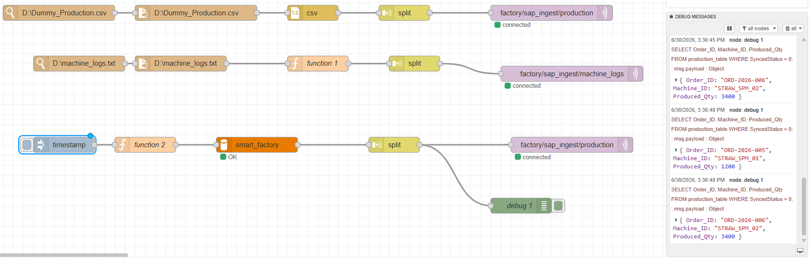

# IIoT Edge Data Bridge Pipeline

A production-grade OT-to-IT Backend Data Pipeline engineered to ingest shop-floor data from diverse industrial sources (Flat files, CSV shift reports, and local Relational Databases) and stream it seamlessly to enterprise cloud systems using **Node-RED**.

---

## 🏗️ Architecture Overview

This edge framework acts as an interoperability data bridge between local physical manufacturing layers and higher-level cloud computation clusters.

[ Industrial Shop Floor Assets ]
├── Legacy Machine Logs ──> (.txt Ingestion) ──┐
├── Batch Shift Reports ──> (.csv Parsing)   ──┼──> [ Node-RED OT Engine ] ──┬──( MQTT )──> [ AWS IoT Core ]
└── Local SQL Datastores ─> (MySQL Query)    ──┘                              └──( HTTP )──> [ API Gateway / Lambda ]


### 📊 Ingestion Capabilities Verified Locally:
1. **Raw Text Log Parser (.txt):** Streamlines string extraction from unstructured legacy automation logs.
2. **Dynamic CSV Ingestor (.csv):** Automatically converts comma-separated manufacturing arrays into structured JSON objects.
3. **Relational Database Synchronization (MySQL):** Implements a low-overhead handshaking routine that pulls only unsynced telemetry data (`SyncedStatus = 0`) directly from the factory floor datastore.

---

## 🔌 Dual-Protocol Network Routing

To bridge the gap between operational automation limits and corporate IT infrastructure, this backend engine supports two core data transmission pipelines:

### 1. MQTT Pipeline (Operational Technology Standard)
* **Broker Endpoint:** `broker.emqx.io` (Port `1883` for local sandboxing) / `AWS IoT Core` (Port `8883` over secure TLS/SSL).
* **Target Topic:** `factory/sap_ingest/production`
* **Performance Metric:** Extremely low protocol overhead (2-byte header), continuous connection state management, and native reporting-by-exception to lower bandwidth usage.

### 2. HTTP REST Pipeline (Information Technology Standard)
* **Method:** `POST`
* **Payload Type:** `application/json`
* **Performance Metric:** Provides a synchronous, firewall-friendly connection that interfaces natively with enterprise load balancers, corporate webhooks, and backend serverless processing frameworks (like **AWS Lambda**).

---

## 💾 Local Environment Deployment Guide

### 1. Database Schema Initialization
To set up the matching test database on your laptop using **XAMPP**, run the schema script located at `/database/database_setup.sql` inside your phpMyAdmin console (`http://localhost:8080/phpmyadmin/`).

### 2. Node-RED Query Logic
The engine utilizes a custom yellow orchestration function to capture telemetry matrices safely without data duplication:

```javascript
var queryText = "SELECT Order_ID, Machine_ID, Produced_Qty FROM production_table WHERE SyncedStatus = 0;";

// Filled across both properties to guarantee cross-driver compatibility
msg.topic = queryText;
msg.payload = queryText;

## 📊 System Architecture & Visual Proof

### 1️⃣ Node-RED Core Pipeline Layout
This flow handles both cloud simulation loops and high-reliability local edge ingestion paths.


### 2️⃣ Local Data Ingestion & JSON Transformation
Proof of the local text/CSV parsing engine successfully converting raw plant-floor data into structured object streams.


### 3️⃣ Unified Broker Delivery (MQTTX Reflection)
The finalized payload successfully mapped, packaged, and transmitted to the MQTT broker.

return msg;